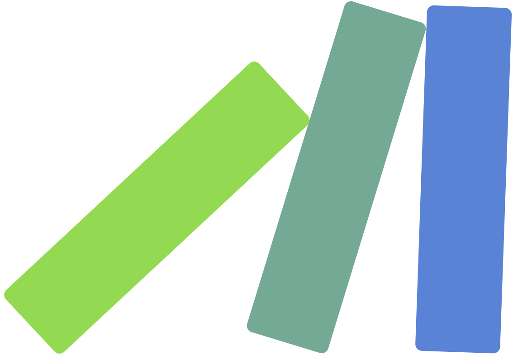

<h1><a href="https://github.com/domino-clj/domino">Domino</a></h1>

[](https://circleci.com/gh/domino-clj/domino) [](https://clojars.org/domino/core) [](https://clojurians.slack.com/messages/domino-clj) [](https://clojars.org/domino/core) [](https://github.com/domino-clj/domino/stargazers)


<h3 class="hidden">See <a href="https://domino-clj.github.io">here</a> for interactive documentation.</h3>

Domino is a data flow engine that helps you organize the interactions between your data model and events. Domino allows you to declare your business logic using a directed acyclic graph of events and effects. Whenever an external change is transacted to the data model, the graph determines the chain of events that will be executed, and side effects triggered as a result of the computation.

Without a way to formalize the interactions between different parts of the application, relationships in code become implicit. This results in code that's difficult to maintain because of the mental overhead involved in tracking these relationships. Domino makes the interactions between pieces of business logic explicit and centralized.

Domino explicitly separates logic that makes changes to the data model from side effectful functions. Business logic functions in Domino explicitly declare how they interact with the data model by declaring their inputs and outputs. Domino then uses these declarations to build a graphs of related events. This approach handles cascading business logic out of the box, and provides a data specification for relationships in code. Once the changes are transacted, the effectful functions are called against the new state.

## Concepts

Domino consists of three main concepts:

### 1. Model

The model represents the paths within an EDN data structure. These paths will typically represent fields within a document. Each path entry is a tuple where the first value is the path segment, and the second value is the metadata associated with it. If the path is to be used for effects and/or events, the metadata must contain the `:id` key.

For example, `[:amount {:id :amount}]` is the path entry to the `:amount` key within the data model and can be referenced in your events and effects as `:amount` (defined by the `:id`). You can nest paths within each other, such as the following model definition:

```clojure
[[:patient [:first-name {:id :fname}]]]
```

### 2. Events

The events define the business logic associated with the changes of the model. Whenever a value is transacted, associated events are computed. Events are defined by three keys; an `:inputs` vector, an `:outputs` vector, and a `:handler` function.

The handler accepts three arguments: a context containing the current state of the engine, a list of the input values, and a list of the output values. The function should produce a vector of outputs matching the declared `:outputs` key. For example:

```clojure
{:inputs  [:amount]
 :outputs [:total]
 :handler (fn [ctx {:keys [amount]} {:keys [total]}]
            {:total (+ total amount)})}
```


Domino also provides a `domino.core/event` helper for declaring events, so the above
event can also be written as follows:

```clojure
(domino.core/event [ctx {:keys [amount]} {:keys [total]}]
  {:total (+ total amount)})
```

The macro requires that the `:keys` destructuring syntax is used for input and outputs, and
expands the the event map with the `:inputs` and `:outputs` keys being inferred from the
ones specified using the `:keys` in the event declaration.

Event handlers can return derefable values for lazy or async computation.
The engine automatically detects and derefs the result before applying it:

```clojure
{:inputs  [:amount]
 :outputs [:total]
 :handler (fn [ctx {:keys [amount]} {:keys [total]}]
            (delay {:total (+ total amount)}))}
```

Any type implementing `IDeref` is supported. On the JVM this includes `delay`, `future`,
and `promise` — the engine will block until the result is available. In ClojureScript,
`delay` can be used for lazy/memoized computation. Truly async operations (e.g. API calls)
should be handled outside the transaction via effects: trigger a side effect, then transact
the result back when it arrives.

### 3. Effects

Effects are used for effectful operations, such as IO, that happen at the edges of
the computation. The effects do not cascade. An effect can contain the following keys:

* `:id` - optional unique identifier for the event
* `:inputs` - optional set of inputs that trigger the event to run when changed
* `:outputs` - optional set of outputs that the event will produce when running the handler
* `:handler` - a function that handles the business logic for the effect

#### Incoming Effects

Effects that declare `:outputs` are used to generate the initial input to the
engine. For example, an effect that injects a timestamp can look as follows:

```clojure
{:id      :timestamp
 :outputs [:ts]
 :handler (fn [_ {:keys [ts]}]
            {:ts (.getTime (java.util.Date.))})}
```

The effect has an `:id` key specifying the unique identifier that is used to trigger the event
by calling the `domino.core/trigger-effects` function. This function accepts a collection of
event ids, e.g: `(trigger-effects ctx [:timestamp])`.

The handler accepts two arguments: a context containing the current state of the engine, and a list of output values.

#### Outgoing Effects

Effects that declare `:inputs` will be run after events have been transacted and the new context is produced. These effects are defined as a map of `:inputs` and a `:handler` function.

The handler accepts two arguments: a context containing the current state of the engine, and a list of input values.

 For example:

```clojure
{:inputs [:total]
 :handler (fn [ctx {:keys [total]}]
            (when (> total 1337)
              (println "Woah. That's a lot.")))}
```

## Usage

**1. Require `domino.core`**

<pre><code class="language-clojure lang-eval-clojure" data-external-libs="https://raw.githubusercontent.com/domino-clj/domino/master/src">
(require '[domino.core :as domino])
</code></pre>

**2. Declare your schema**

Let's take a look at a simple engine that accumulates a total. Whenever an amount is set, this value is added to the current value of the total. If the total exceeds `1337` at any point, it prints out a statement that says `"Woah. That's a lot."`

```clojure lang-eval-clojure
(def schema
  {:model   [[:amount {:id :amount}]
             [:total {:id :total}]]
   :events  [{:id      :update-total
              :inputs  [:amount]
              :outputs [:total]
              :handler (fn [ctx {:keys [amount]} {:keys [total]}]
                         {:total (+ total amount)})}]
   :effects [{:inputs [:total]
              :handler (fn [ctx {:keys [total]}]
                         (when (> total 1337)
                           (js/alert "Woah. That's a lot.")))}]})
```

This schema declaration is a map containing three keys:

* The `:model` key declares the shape of the data model used by Domino.
* The `:events` key contains pure functions that represent events that are triggered when their inputs change. The events produce updated values that are persisted in the state.
* The `:effects` key contains the functions that produce side effects based on the updated state.

Using a unified model referenced by the event functions allows us to easily tell how a particular piece of business logic is triggered.

The event engine generates a direct acyclic graph (DAG) based on the `:input` keys declared by each event that's used to compute the new state in a transaction. This approach removes any ambiguity regarding when and how business logic is executed.

Domino explicitly separates the code that modifies the state of the data from the code that causes side effects. This encourages keeping business logic pure and keeping the effects at the edges of the application.

**3. Initialize the engine**

The `schema` that we declared above provides a specification for the internal data model and the code that operates on it. Once we've created a schema, we will need to initialize the data flow engine. This is done by calling the `domino/initialize` function. This function can be called by providing a schema along with an optional initial state map. In our example, we will give it the `schema` that we defined above, and an initial value for the state with the `:total` set to `0`.

```clojure lang-eval-clojure
(def ctx (atom (domino/initialize schema {:total 0})))
```

Calling the `initialize` function creates a context `ctx` that's used as the initial state for the engine. The context will contain the model, events, effects, event graph, and db (state). In our example we use an atom in order to easily update the state of the engine.

**4. Transact your external data changes**

We can update the state of the data by calling `domino/transact` that accepts the current `ctx` along with an inputs vector, returning the updated `ctx`. The input vector is a collection of path-value pairs. For example, to set the value of `:amount` to `10`, you would pass in the following input vector `[[[:amount] 10]]`.

```clojure lang-eval-clojure
(swap! ctx domino/transact [[[:amount] 10]])
```

The updated `ctx` contains `:domino.core/change-history` key which is a simple vector of all the changes as they were applied to the data in execution order of the events that were triggered.

```clojure lang-eval-clojure
(:domino.core/change-history @ctx)
```

We can see the new context contains the updated total amount and the change history shows the order in which the changes were applied.

The `:domino.core/db` key in the context will contain the updated state reflecting the changes applied by running the events.

```clojure lang-eval-clojure
(:domino.core/db @ctx)
```

Finally, let's update the `:amount` to a value that triggers an effect.

```clojure lang-eval-clojure
(require '[reagent.core :as reagent])

(defn button []
  [:button
   {:on-click #(swap! ctx domino/transact [[[:amount] 2000]])}
   "trigger effect"])

(reagent/render-component [button] js/klipse-container)
```

### Interceptors

Domino provides the ability to add interceptors pre and post event execution. Interceptors are defined in the schema's model. If there are multiple interceptors applicable, they are composed together.

In the metadata map for a model key, you can add a `:pre` and `:post` key to define these interceptors.
Returning a `nil` value from an interceptor will short circuit execution. For example, we could check
if the context is authorized before running the events as follows:

```clojure lang-eval-clojure
(let [ctx (domino/initialize
            {:model  [[:foo {:id   :foo
                             :pre  [(fn [handler]
                                      (fn [ctx inputs outputs]
                                        ;; only run the handler if ctx contains
                                        ;; :authorized key
                                        (when (:authorized ctx)
                                          (handler ctx inputs outputs))))]
                             :post [(fn [handler]
                                      (fn [result]
                                        (handler (update result :foo #(or % -1)))))]}]]
             :events [{:inputs  [:foo]
                       :outputs [:foo]
                       :handler (fn [ctx {:keys [foo]} outputs]
                                  {:foo (inc foo)})}]})]
  (map :domino.core/db
       [(domino/transact ctx [[[:foo] 0]])
        (domino/transact (assoc ctx :authorized true) [[[:foo] 0]])]))
```

### Triggering Effects

Effects can act as inputs to the data flow engine. For example, this might happen when a button is clicked and you want a value to increment. This can be accomplished with a call to `trigger-effects`.

`trigger-effects` takes a list of effects that you would like trigger and calls `transact` with the current state of the data from all the inputs of the effects. For example:

```clojure lang-eval-clojure
(let [ctx
      (domino.core/initialize
        {:model   [[:total {:id :total}]]
         :effects [{:id      :increment-total
                    :outputs [:total]
                    :handler (fn [_ current-state]
                               (update current-state :total inc))}]}
        {:total 0})]

(:domino.core/db (domino.core/trigger-effects ctx [:increment-total])))
```

This wraps up everything you need to know to start using Domino. You can see a more detailed example using Domino with re-frame [here](https://domino-clj.github.io/demo).

## Possible Use Cases

- UI state management
- FSM
- Reactive systems / spreadsheet-like models

## Example App

* demo applications can be found [here](https://github.com/domino-clj/examples)

## Inspirations

- [re-frame](https://github.com/Day8/re-frame)
- [javelin](https://github.com/hoplon/javelin)
- [reitit](https://github.com/metosin/reitit)

## License

Copyright © 2019-2026

Distributed under the Eclipse Public License either version 1.0 or (at
your option) any later version.
